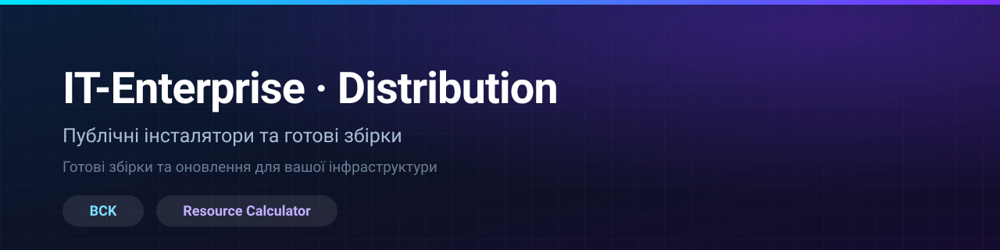

<div align="center">



### Публічний канал розповсюдження

Тут немає вихідного коду — лише **інсталятори та готові збірки** для користувачів.

<br>

<a href="https://ajjs1ajjs.github.io/dist/"></a>

<br><br>

<a href="#bck"></a>
<a href="#calculator"></a>
<a href="#diskcleaner"></a>
<a href="#gym"></a>
<a href="#kubelens"></a>
<a href="#monitoring"></a>
<a href="#mygit"></a>
<a href="#rdm"></a>
<a href="#sales"></a>
<a href="#uptime-monitor"></a>

<sub><b>10 продуктів</b> &nbsp;·&nbsp; Linux &nbsp;·&nbsp; Windows &nbsp;·&nbsp; Web / PWA &nbsp;·&nbsp; зібрано локально, перевірено SHA-256</sub>

</div>

---

<a id="products"></a>

## 📦 Продукти

<table>
<tr>
<td align="center" width="50%">
<br>
<a href="#bck"></a>
<br>
<sub>Ubuntu 24 / 25 / 26 · x86_64</sub>
<br><br>
Enterprise backup &amp; disaster recovery — Veeam-альтернатива
<br><br>
<a href="#bck">⬇️ <b>Завантажити</b></a>
<br><br>
</td>
<td align="center" width="50%">
<br>
<a href="#calculator"></a>
<br>
<sub>Windows 10 / 11 · x64</sub>
<br><br>
Розрахунок ресурсів IT-інфраструктури за матрицею сайзингу
<br><br>
<a href="#calculator">⬇️ <b>Завантажити</b></a>
<br><br>
</td>
</tr>
<tr>
<td align="center" width="50%">
<br>
<a href="#diskcleaner"></a>
<br>
<sub>Windows 10 / 11 · x64</sub>
<br><br>
Чистка диска <code>C:</code> — тимчасові файли, кеші, логи, залишки білдів
<br><br>
<a href="#diskcleaner">⬇️ <b>Завантажити</b></a>
<br><br>
</td>
<td align="center" width="50%">
<br>
<a href="#gym"></a>
<br>
<sub>Web · PWA</sub>
<br><br>
Офлайн-трекер тренувань і прогресу тіла
<br><br>
<a href="#gym">▶️ <b>Відкрити</b></a>
<br><br>
</td>
</tr>
<tr>
<td align="center" width="50%">
<br>
<a href="#kubelens"></a>
<br>
<sub>Windows 10 / 11 · x64</sub>
<br><br>
Kubernetes desktop IDE — workloads, логи, Helm, топологія
<br><br>
<a href="#kubelens">⬇️ <b>Завантажити</b></a>
<br><br>
</td>
<td align="center" width="50%">
<br>
<a href="#monitoring"></a>
<br>
<sub>Ubuntu 24 / 25 / 26 · amd64/arm64</sub>
<br><br>
Моніторинг інфраструктури та NOC-дашборд
<br><br>
<a href="#monitoring">⬇️ <b>Завантажити</b></a>
<br><br>
</td>
</tr>
<tr>
<td align="center" width="50%">
<br>
<a href="#mygit"></a>
<br>
<sub>Ubuntu 24 / 25 / 26 · amd64/arm64</sub>
<br><br>
Self-hosted Git-платформа — GitLab/Gitea-альтернатива
<br><br>
<a href="#mygit">⬇️ <b>Завантажити</b></a>
<br><br>
</td>
<td align="center" width="50%">
<br>
<a href="#rdm"></a>
<br>
<sub>Windows 10 / 11 · x64</sub>
<br><br>
Менеджер віддалених підключень (SSH/RDP) для SRE/DevOps
<br><br>
<a href="#rdm">⬇️ <b>Завантажити</b></a>
<br><br>
</td>
</tr>
<tr>
<td align="center" width="50%">
<br>
<a href="#sales"></a>
<br>
<sub>Web · PWA</sub>
<br><br>
Радар знижок і безкоштовних ігор (Steam / Epic)
<br><br>
<a href="#sales">▶️ <b>Відкрити</b></a>
<br><br>
</td>
<td align="center" width="50%">
<br>
<a href="#uptime-monitor"></a>
<br>
<sub>Ubuntu / Debian 24 / 25 / 26 · amd64/arm64</sub>
<br><br>
Моніторинг доступності та SSL, сповіщення, SLA-звіти
<br><br>
<a href="#uptime-monitor">⬇️ <b>Завантажити</b></a>
<br><br>
</td>
</tr>
</table>

---

<a id="download"></a>

## ⬇️ Завантаження

### Встановлення одною командою

Одна команда і **встановлює, і оновлює**: конфіг, база, користувачі та пароль зберігаються,
замінюється лише бінарник.

| Продукт | Команда |
|---|---|
| 🗄️ **BCK** | `curl -fsSL https://raw.githubusercontent.com/ajjs1ajjs/dist/main/apps/bck/install.sh \| sudo bash` |
| 📡 **PyMon NOC** | `curl -sSL https://raw.githubusercontent.com/ajjs1ajjs/dist/main/apps/monitoring/install.sh \| sudo bash` |
| 🐙 **MyGit** | `curl -sSL https://raw.githubusercontent.com/ajjs1ajjs/dist/main/apps/mygit/install.sh \| sudo bash` |
| ⏱️ **Uptime Monitor** | `curl -sSL https://raw.githubusercontent.com/ajjs1ajjs/dist/main/apps/uptime-monitor/install.sh \| sudo bash` |

---

<a id="bck"></a>

### 🗄️ BCK

<a href="https://github.com/ajjs1ajjs/dist/releases?q=bck"></a>

**Ubuntu 24 / 25 / 26 · x86_64** — Enterprise backup & disaster recovery (Veeam-альтернатива).

```bash
curl -fsSL https://raw.githubusercontent.com/ajjs1ajjs/dist/main/apps/bck/install.sh | sudo bash
```

- Встановлює `bckd`, `bck-agent`, `bck`, `bck-proxy` і вебконсоль.
- Реєструє systemd-сервіс з автоперезапуском при збої.
- Перевіряє SHA256 архіву перед встановленням.

[📜 Скрипт встановлення](apps/bck/install.sh) &nbsp;·&nbsp; [⬇️ Усі релізи BCK](https://github.com/ajjs1ajjs/dist/releases?q=bck)

---

<a id="calculator"></a>

### 🧮 Resource Calculator

<a href="https://github.com/ajjs1ajjs/dist/releases?q=calculator"></a>

**Windows 10 / 11 · x64** — портативний застосунок, **один `.exe`**, встановлення не потрібне.

<a href="https://github.com/ajjs1ajjs/dist/releases?q=calculator">
  
</a>

- Завантажте `ITE.ResourceCalculator.exe`, звірте з `SHA256SUMS.txt`, запустіть.
- Далі програма **оновлюється сама** — читає релізи цього репозиторію.

[📖 Деталі та перевірка](apps/calculator/README.md) &nbsp;·&nbsp; [⬇️ Усі релізи Calculator](https://github.com/ajjs1ajjs/dist/releases?q=calculator)

---

<a id="diskcleaner"></a>

### 🧹 DiskCleaner

<a href="https://github.com/ajjs1ajjs/dist/releases?q=diskcleaner"></a>

**Windows 10 / 11 · x64** — портативний очищувач диска, **один `.exe`**, встановлення не потрібне.

<a href="https://github.com/ajjs1ajjs/dist/releases?q=diskcleaner">
  
</a>

- Завантажте `DiskCleaner.exe`, звірте з `SHA256SUMS.txt`, запустіть.
- Агресивні пункти (Windows.old, Prefetch) вимкнені за замовчуванням.

[📖 Деталі та перевірка](apps/diskcleaner/README.md) &nbsp;·&nbsp; [⬇️ Усі релізи DiskCleaner](https://github.com/ajjs1ajjs/dist/releases?q=diskcleaner)

---

<a id="gym"></a>

### 🏋️ Gym Tracker

<a href="https://ajjs1ajjs.github.io/dist/gym/"></a>

**Web · PWA** — офлайн-first, працює у браузері, встановлюється на телефон, дані зберігаються локально.

<a href="https://ajjs1ajjs.github.io/dist/gym/">
  
</a>

- Відкрийте у браузері або додайте на головний екран телефона.
- Збірка застосунку лежить у [`gym/`](gym/) (GitHub Pages).

[📖 Деталі](apps/gym/README.md)

---

<a id="kubelens"></a>

### 🔭 KubeLens

<a href="https://github.com/ajjs1ajjs/dist/releases?q=kubelens"></a>

**Windows 10 / 11 · x64** — Kubernetes desktop IDE, **один інсталятор NSIS**, оновлюється всередині.

<a href="https://github.com/ajjs1ajjs/dist/releases?q=kubelens">
  
</a>

- Завантажте `KubeLens_*_x64-setup.exe`, встановіть, запустіть.
- Далі застосунок сам перевіряє оновлення при старті (підпис minisign).

[📖 Деталі та перевірка](apps/kubelens/README.md) &nbsp;·&nbsp; [⬇️ Усі релізи KubeLens](https://github.com/ajjs1ajjs/dist/releases?q=kubelens)

---

<a id="monitoring"></a>

### 📡 PyMon NOC

<a href="https://github.com/ajjs1ajjs/dist/releases?q=monitoring"></a>

**Ubuntu 24 / 25 / 26 · amd64/arm64** — сервер моніторингу інфраструктури.

```bash
curl -sSL https://raw.githubusercontent.com/ajjs1ajjs/dist/main/apps/monitoring/install.sh | sudo bash
```

- Ставить systemd-сервіс; конфіг, база й користувачі зберігаються при оновленні.
- Перевіряє SHA-256 бінарника перед встановленням.

[📜 Скрипт встановлення](apps/monitoring/install.sh) &nbsp;·&nbsp; [📖 Деталі](apps/monitoring/README.md) &nbsp;·&nbsp; [⬇️ Усі релізи PyMon](https://github.com/ajjs1ajjs/dist/releases?q=monitoring)

---

<a id="mygit"></a>

### 🐙 MyGit

<a href="https://github.com/ajjs1ajjs/dist/releases?q=mygit"></a>

**Ubuntu 24 / 25 / 26 · amd64/arm64** — self-hosted Git-платформа.

```bash
curl -sSL https://raw.githubusercontent.com/ajjs1ajjs/dist/main/apps/mygit/install.sh | sudo bash
```

- Ставить systemd-сервіс; дані, репозиторії й користувачі зберігаються при оновленні.
- Перевіряє SHA-256 бінарника перед встановленням.

[📜 Скрипт встановлення](apps/mygit/install.sh) &nbsp;·&nbsp; [📖 Деталі](apps/mygit/README.md) &nbsp;·&nbsp; [⬇️ Усі релізи MyGit](https://github.com/ajjs1ajjs/dist/releases?q=mygit)

---

<a id="rdm"></a>

### 🔌 RDM Manager

<a href="https://github.com/ajjs1ajjs/dist/releases?q=rdm"></a>

**Windows 10 / 11 · x64** — **NSIS-інсталятор** або portable ZIP, оновлюється всередині.

<a href="https://github.com/ajjs1ajjs/dist/releases?q=rdm">
  
</a>

- `RDM.Manager_<версія>_x64-setup.exe` — інсталятор; `…Portable.zip` — портативна версія.
- Далі застосунок сам перевіряє оновлення при старті (підпис minisign).

[📖 Деталі](apps/rdm/README.md) &nbsp;·&nbsp; [⬇️ Усі релізи RDM](https://github.com/ajjs1ajjs/dist/releases?q=rdm)

---

<a id="sales"></a>

### 🎮 Game Sales

<a href="https://ajjs1ajjs.github.io/dist/sales/"></a>

**Web · PWA** — радар знижок і безкоштовних ігор (Steam / Epic), оновлюється автоматично.

<a href="https://ajjs1ajjs.github.io/dist/sales/">
  
</a>

- Відкрийте у браузері або встановіть як застосунок (PWA), працює офлайн.
- Дані й збірка лежать у [`sales/`](sales/); збір даних — у [`apps/sales/fetch/`](apps/sales/fetch/).
- Telegram-канал: [@salesgamesua](https://t.me/salesgamesua).

[📖 Деталі](apps/sales/README.md)

---

<a id="uptime-monitor"></a>

### ⏱️ Uptime Monitor

<a href="https://github.com/ajjs1ajjs/dist/releases?q=uptime"></a>

**Ubuntu / Debian 24 / 25 / 26 · amd64/arm64** — моніторинг доступності сайтів, сервісів і SSL.

```bash
curl -sSL https://raw.githubusercontent.com/ajjs1ajjs/dist/main/apps/uptime-monitor/install.sh | sudo bash
```

- Ставить systemd-сервіс; конфіг, БД, користувачі та пароль зберігаються при оновленні.
- Перевіряє SHA-256 бінарника (`checksums.txt`) перед встановленням.
- Невдалий старт не рапортується як успіх — бінарник відкочується.

[📜 Скрипт встановлення](apps/uptime-monitor/install.sh) &nbsp;·&nbsp; [📖 Деталі](apps/uptime-monitor/README.md) &nbsp;·&nbsp; [⬇️ Усі релізи Uptime Monitor](https://github.com/ajjs1ajjs/dist/releases?q=uptime)

---

## 👨‍💻 Автор

**Ярослав (AJ.SRE/DevOps/Dev)** — SRE / DevOps / Software Developer.

- 🚀 [Портфоліо + кейси](https://site.yaroslav-andreichuk.workers.dev) — 10 продуктів, живий термінал, форма заявки
- 📩 yaroslav.andreichuk@gmail.com · ✈️ [Telegram](https://t.me/+380979454941)
